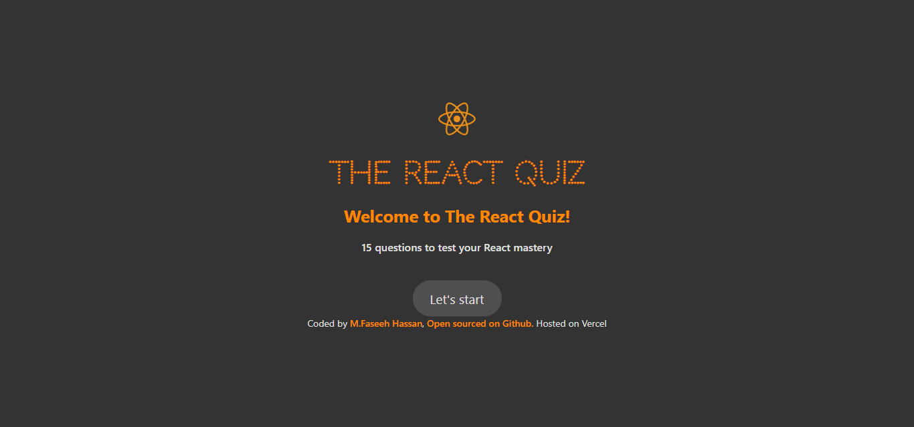

# React Quiz App

This is a web app developed as a intership task2 project given form VerveBridge in which i used React.js. It allows users to participate in quizzes on React topics, testing their knowledge and providing immediate feedback. The app dynamically fetches quiz questions and displays results based on the user’s answers.

<h2 align="center">
  <a href="https://react-quiz-app-faseeh.vercel.app/" target="_blank">React-Quiz-App-Faseeh.vercel.app</a>
</h2>

  
  

# Features

- Users can participate in quizzes on various topics.
- The app displays quiz questions, allows users to select answers, and provides immediate feedback.
- The app dynamically fetches quiz questions and displays results based on the user's answers.

# Technologies & Tools Used

- React.js
- HTML
- CSS
- JavaScript
- VS Code

# Installation and Usage

To use this app, you can follow these steps:

- Clone the repository or download the source code.
- Open the project in your preferred code editor.
- Run npm install to install the necessary dependencies.
- Run npm start to start the development server.
- Open your browser and navigate to http://localhost:3000 to use the app.

To use the app, simply start a quiz, answer the questions, and view your results at the end.

# Demo

A live demo of the React Quiz App is available at LINK TO LIVE DEMO.

# Credits

The Quiz App was created by M. Faseeh Hassan as an internship task for VerveBridge during a React workshop.

### Show your support

Give a ⭐ if you like this website!
